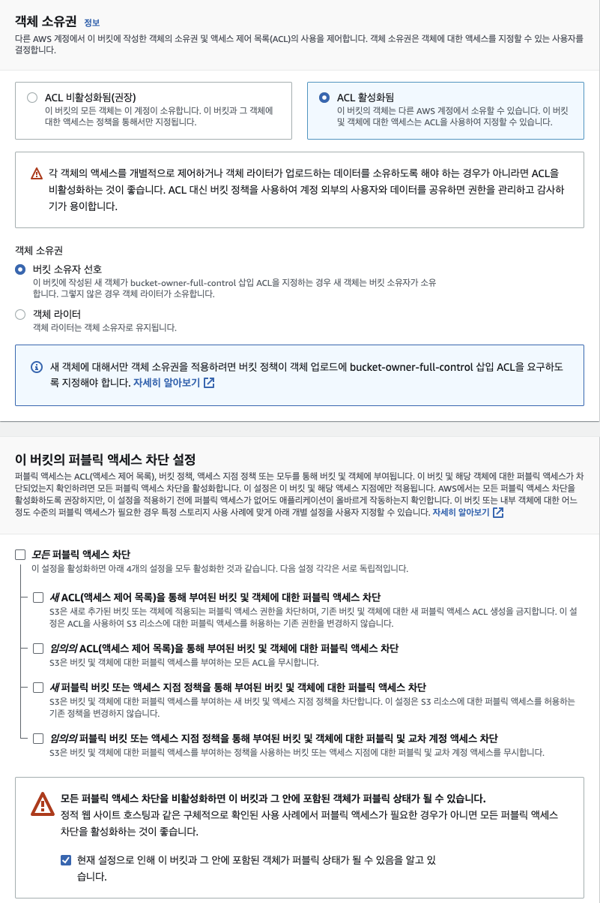

## AWS S3 bucket에 이미지 저장하기

> 📌 로컬 이미지 파일을 S3 버킷에 저장하는 기능입니다.

### AWS S3 버킷 생성



버킷 생성 과정에서 위 사진과 같은 설정이 필요합니다. 디폴트 설정이 아니므로 따로 저렇게 설정해야 합니다.  
정확히 어떤 기능인지는 모르겠지만 뭔가 굉장히 보안적으로 취약하게 만드는 행위인 것 같아 보입니다. (조금 불안)  
하지만 위와 같이 설정을 하지 않으면 당장 실습에서 파일이 업로드 되지 않습니다.  
이 부분에 대해서는 자세히 공부할 필요가 있을 것 같습니다.

### 필요 패키지 설치

```zsh
npm install aws-sdk
npm install multer
npm install multer-s3@2.10.0
```

여기서 주의할 점은 `multer-s3의 버전을 지정해줘야 한다는 점`입니다. 현재 날짜(22.07.13) 기준으로 aws-sdk 설치 시 버전 2.1414.0로 설치되는데 multer-s3를 그냥 설치하면 3.x.x 대로 설치가 됩니다. 이러면 호환이 안되므로 위와 같이 설치가 필요합니다. 향후 aws-sdk 3.x.x대를 사용하게 된다면 multer-s3역시 맞춰줘야 합니다.

### 본격 실습

#### 1\. 프론트에서 로컬 이미지를 등록하고 업로드 버튼을 클릭하면 기능 동작이 시작됩니다.

```html
<body>
  <form id="img-upload-form" enctype="multipart/form-data" onsubmit="return false">
    <input
      id="img-file"
      type="file"
      accept="image/png, image/jpg, image/jpeg, image/bmp, image/gif"
    />
    <input type="submit" id="img-upload" value="업로드" />
  </form>

  <script>
    $(document).ready(() => {
      const imgUploadForm = document.getElementById('img-upload-form');
      imgUploadForm.addEventListener('submit', async () => {
        const formData = new FormData();
        const profileImage = $('#img-file').prop('files')[0];
        formData.append('profileImage', profileImage);

        try {
          const res = await fetch('/api/users/info/images', {
            method: 'POST',
            body: formData,
          });
          const data = await res.json();
          alert(data.message);
        } catch (err) {
          console.error(err);
        }
      });
    });
  </script>
</body>
```

프론트 단에서 input태그의 accept 옵션을 통해 등록 가능한 파일을 이미지로 한정합니다.  
업로드 버튼을 클릭하면 input태그의 프로퍼티 중 files에 해당하는 정보를 `formData`형태로 백엔드에 전달합니다.  
formData에 append할 때 이름을 'profileImage'로 설정하고 있습니다. 나중에 이 이름이 버킷 업로드 시 사용되므로 기억해둬야 합니다.

---

#### 2\. 버킷에 업로드는 서버 API의 미들웨어로 처리합니다.

```javascript
// bucket.middleware.js
const multer = require('multer');
const multerS3 = require('multer-s3');
const AWS = require('aws-sdk');
const { v4: uuidv4 } = require('uuid');
const s3 = new AWS.S3({
  accessKeyId: process.env.S3_ACCESS_KEY,
  secretAccessKey: process.env.S3_SECRET_ACCESS_KEY,
  region: process.env.S3_BUCKET_REGION,
});

class UploadBucket {
  constructor() {
    // 프로필 사진 저장 경로
    this.profileImageDir = 'images/profile';
    // this.postImageDir = 'images/posts';
  }

  // 버킷 업로드 틀
  upload = (saveDir) =>
    multer({
      storage: multerS3({
        s3: s3,
        bucket: process.env.S3_BUCKET_NAME,
        shouldTransform: true, // 뭘 트랜스폼 한다는거지?
        key: (req, file, callback) => {
          callback(null, `${saveDir}/${Date.now()}_${uuidv4()}`);
        },
        acl: 'public-read-write',
        limits: { fileSize: 5 * 1024 * 1024 }, // 이미지 용량을 5MB이하로 제한
        contentType: multerS3.AUTO_CONTENT_TYPE, // 파일의 Content-Type 자동 설정
        metadata: (req, file, callback) => {
          callback(null, { fieldName: file.fieldname });
        },
      }),
    });

  // 프로필 사진 버킷 업로드
  profileImage = (targetFile) => this.upload(this.profileImageDir).single(targetFile);
  // 만약 게시글 사진 업로드를 구현한다면...
  // postImage = (targetFile) => this.upload(this.postImageDir).single(targetFile);
}

module.exports = UploadBucket;
```

현재 프로필 사진 등록을 위한 기능만 구현되어 있지만 향후 다양한 분류의 이미지 또는 파일 업로드 기능이 추가될 것을 고려하여 클래스 형태로 구현하였습니다.  
만약 게시글 사진 업로드 기능을 추가한다면 this.upload 함수를 재사용하여 버킷저장 경로만 설정해주면 간단히 추가할 수 있도록 구현했습니다.  
저장할 파일명은 현재시각 + uuidv4를 사용합니다. 이는 한글 파일명의 파일이 업로드 될 경우 인코딩관련 문제로 파일 이름이 괴랄해지거나 비약적으로 길어지는 문제가 발생하여 DB에 저장되지 않는 경우가 발생하여 이와 같이 조치했습니다.

---

#### 3. 엔트리 포인트(app.js)에서 추가 설정을 합니다.

```javascript
// app.js
app.use(express.json({ limit: '10mb' }));
app.use(express.urlencoded({ limit: '10mb', extended: false }));
```

이전까지 API 응답을 통해 문자열만 전달했다면 이번에는 비교적 대용량인 이미지를 전달해야 합니다.  
그래서 지금까지는 전송에 필요한 json과 urlencoded의 디폴트 값을 사용했지만 사진과 같이 일정량 이상의 크기를 지닌 데이터를 전송한다면 허용 범위를 확장해줘야 합니다.

---

#### 4. 백엔드에서 아래와 같이 미들웨어로 처리됩니다.

```javascript
const UploadBucket = require('../middlewares/bucket.middleware');
const upload = new UploadBucket();

// 프로필 사진 업로드
userRouter.post(
  '/users/info/images',
  auth.verifyAccessToken,
  upload.profileImage('profileImage'),
  userController.uploadProfileImage
);
```

API는 마이 페이지에서 이미지를 추가하는 형태를 의도했으며, 본인 검증 이후 이미지를 버킷에 업로드하는 미들웨어로 처리됩니다. 마지막 단의 컨트롤러에서는 버킷 업로드 후 얻은 객체 URL을 데이터베이스에 저장합니다.  
사실 버킷에는 이미지가 저장되었지만 DB 업데이트 과정에서 오류가 발생한다면 정보에 차이가 발생합니다. 이를 방지하기 위해서는 DB에 이미지 객체 URL 정보를 업데이트한 뒤 버킷에 업로드하는 순서를 가지면 좋겠지만 현재로서는 버킷에 업로드 한 이후 객체 URL을 획득하고 있어 이 부분에 대한 고민이 필요합니다.
